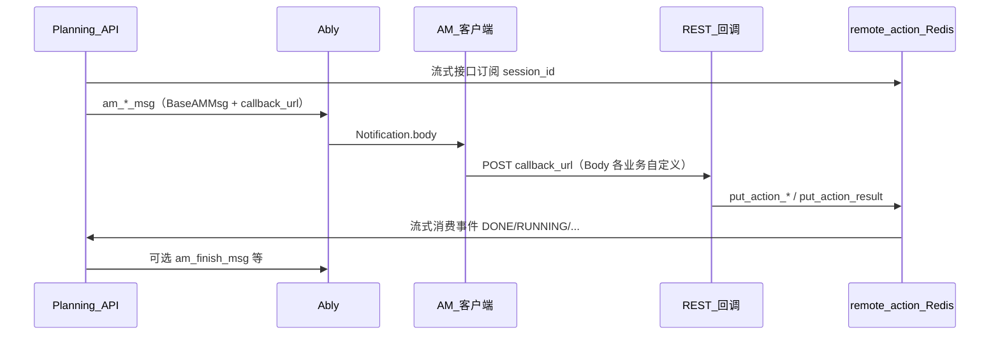

# Action Model 通讯重构方案

状态：草案 | 日期：2026-03-19

---

## 0. 文档目的与阅读方式

本方案描述 **Planning API ↔ 客户端 Action Model（AM）** 在 **下行指令、上行回调、会话编排** 三段的现状与重构方向。  
**核心主线**：用统一的 **场景标识（scenario）+ 信封（envelope）+ 业务载荷（payload）** 贯穿 Ably 推送与 HTTP 回调，使「发什么指令、回什么结果、落到哪条 REST」可对照、可演进，而不是把「消息定义」「回调入口」「remote_action」当作彼此独立的三件事。

---

## 1. 术语

| 术语 | 说明 |
|------|------|
| **Planning API** | 本服务：编排对话、向 AM 下发指令、接收 HTTP 回调 |
| **AM / 客户端** | 设备端：收 Ably、执行 UI/自动化、按 `callback_url` POST 结果 |
| **remote_action** | Redis Pub/Sub：`remote_action:{session_id}`，把「流式 request 侧」与「HTTP 回调侧」对齐 |
| **scenario** | 稳定的业务场景标识（建议枚举），**对外契约**优先用 scenario，而非 Python 类名 |
| **信封 envelope** | 传输层公共字段：`session_id`、`task_id`、`schema_version`、`scenario`、`event`（上行）等 |
| **payload** | 仅承载该场景下的业务字段，上下行结构尽量对称或可映射 |

---

## 2. 端到端链路（现状一条线）

下面是一条逻辑上的完整闭环，**下行、回调、编排**都发生在同一条业务链上：



**现状要点（与代码对应）**

| 段 | 实现要点 | 主要代码位置 |
|----|----------|----------------|
| 下行 | `AmNotificationService._publish` → `Notification.from_instance(msg)` → Ably；载荷为各 `BaseAMMsg` 子类 | `am_notification_service.py`、`src/msg/am_*.py`、`base_am_msg.py` |
| 回调 | 多个独立 path，Body 不统一；内层调 `put_action_result` / `put_action_done` / `put_action_error` | `rest/action_model.py`、`rest/device.py`、`rest/install_app.py`、`rest/line.py`、`rest/im_chat_list.py` 等 |
| 编排 | `session_id` 为键；无订阅者时 `put` 返回 `False`，业务据此不写库或发 `am_finish_msg` | `remote_action_queue.py`、`remote_action_manager.py` |
| 典型例 | 安装：`InstallAppService` 起流 → `am_install_app_msg` 带 `/device/install_app_done` → 回调 `put_action_*` → 流结束 | `install_app_service.py`、`rest/device.py` |

**问题本质（一条线上的问题）**：下行里带了 `callback_url`，但 **URL 与 Body 形态没有与「消息 type / 场景」绑定成表**；上行每个 path 一套 Body，**没有与下行 payload 对称的信封**，导致协议分散、文档难维护、扩展易漏字段。

---

## 3. 目标架构（重构后的一条线）

重构后仍保留 **Ably + HTTP + Redis** 三段基础设施，变化集中在 **契约与接入方式**：

1. **统一场景 scenario**  
   每个业务能力对应唯一 scenario（如 `install_app`、`line_send_msg`、`im_chat_list_save`）。下行、上行、文档、超时配置、回调路由表 **都以 scenario 为第一键**。

2. **统一信封 + payload（上下行对称）**  
   - **下行（Ably body）**：建议演进为 `{ "schema_version": 1, "scenario": "...", "session_id": "...", "task_id": "...", "callback": { "mode": "path_key" | "url", "value": "..." }, "payload": { ... } }`（`callback` 可先等价于今天的 `callback_url`，再收敛为逻辑 key 由服务端解析 URL）。  
   - **上行（HTTP POST）**：同一套外层字段 + `event`（如 `progress` / `done` / `error`）+ `payload`；网关按 `scenario` 分发到现有 service，**path 可收敛为少量入口**。

3. **callback 与消息绑定**  
   **服务端维护「scenario → 默认回调 path 或模板」**，`AmNotificationService` 只填逻辑 key 或从工厂取 URL，禁止各业务复制粘贴 path 字符串。

4. **remote_action 作为编排端口**  
   对业务暴露「会话任务」抽象（订阅、投递、监听者判断），REST 层只做「解析信封 → 调端口 → 返回 HTTP」，减少重复。

5. **可观测**  
   全链路日志强制带 `session_id` 与 `task_id`（及可选 `scenario`），关键步骤单条日志用 `|` 拼接字段，便于检索。

---

## 4. 现状问题汇总（按主线归纳）

| 维度 | 问题 |
|------|------|
| **契约** | 下行有 `BaseAMMsg`，上行无统一信封；`type` 用类名，与客户端协议耦合实现细节 |
| **回调** | path 多、`callback_url` 散落、与 `install_app` / `device` 等路径并存，易漂移 |
| **消息与回调脱节** | 没有「scenario 一行表」映射：下行类、Ably body、回调 path、payload 字段、是否走 `put_action_*` |
| **编排** | `put_action_*` 与超时、监听者判断分散在各 `rest`，模式重复（安装、LINE、IM…） |
| **配置** | `AM_MSG_TIMEOUTS` 按类名字符串；超时与 scenario、回调 path 未绑定 |
| **可观测** | Ably / HTTP / Redis 三段靠手工从日志拼链路 |

---

## 5. 重构方案（整体工作项，彼此衔接）

下列工作项 **需按顺序穿插落地**，不是五条平行线；**P0 契约表** 是所有后续改动的前提。

### 5.1 工作项 A — 契约与目录（P0，优先）

- 建立 **《AM 通讯目录》** 表格（Markdown 或生成页），每行至少包含：  
  `scenario` | 下行消息类 | `am_notification_service` 方法 | 当前回调 path | Body 关键字段 | 是否 `put_action_*` | `am_task_done` 约定  
- 与客户端对齐：**每个 scenario 唯一推荐的回调 URL**（过渡期可列 deprecated path）。  
- **与 §6 路线图阶段 1 合并执行。**

### 5.2 工作项 B — 回调收敛（与信封配套）

- 新增 **回调网关**（示例：`POST /remote/am/callback`）：HTTP 外层解析 **统一信封**（`scenario`、`session_id`、`task_id`、`event`、`payload`、`am_task_done`），内层 `dispatch(scenario, event, payload)` 调现有业务逻辑。  
- **旧 path**：保留期内做转发或文档标记废弃，避免一次性打断客户端。  
- **鉴权**：在方案阶段明确「全走 auth_user」或「部分回调 token/signature」；写进目录表。

### 5.3 工作项 C — 下行消息演进（与 scenario / 信封对齐）

- 引入 **scenario 枚举** + **类名 → scenario 映射**；新消息必须带 `scenario`，旧消息可补字段（客户端忽略则兼容）。  
- 业务字段逐步收拢为 **`XxxPayload` 子模型**，`BaseAMMsg` 侧重信封类字段 + UX 字段（title/detail 等）。  
- `AM_MSG_TIMEOUTS` 改为按 **scenario** 索引（类名仅影响映射层）。  
- Ably `body` **双写期**：同时保留扁平字段与 `{ envelope, payload }`，客户端迁移后删扁平形态（见 §6）。

### 5.4 工作项 D — remote_action 与 REST 减薄

- 抽取 **会话任务端口**（命名示例 `AmSessionTask`）：封装 `remote_action_stream`、`put_action_*`、超时、`has_subscribed` 判断。  
- 各业务 `callback` handler：**校验/解析信封 → 调端口 → 必要时 `am_finish_msg`**，避免重复样板代码。

### 5.5 工作项 E — callback_url 与配置

- 集中模块：`PLANNING_API_BASE_URL` + **按 scenario 的 path 模板**（或 path key → 全 URL）；`InstallAppService` 等只调用工厂方法。  
- 与 **工作项 B** 联动：若将来只暴露网关 path，模板统一指向网关，query 或 body 带 `scenario`。

### 5.6 工作项 F — 观测与幂等（可选增强）

- 日志规范：`[AM_COMM][scenario=...|session_id=...|task_id=...]`。  
- 待评审：上行是否带 **idempotency-key**（防重复回调写库）。

---

## 6. 统一路线图（单表，含消息+回调+编排）

| 阶段 | 目标 | 主要交付 | 风险 |
|------|------|----------|------|
| **1** | 对齐现实 | 《AM 通讯目录》+ 废弃 path 说明；客户端确认唯一回调 URL | 低 |
| **2** | 配置收口 | scenario 枚举、映射表、`callback_url` 工厂；超时改按 scenario | 低 |
| **3** | 回调网关 | 新入口 + 旧 path 兼容；信封 Pydantic 模型；分发到现有 service | 中 |
| **4** | 消息双写 | 下行 body 增加 envelope + payload，旧字段保留 | 中 |
| **5** | 编排抽象 | `AmSessionTask`（或等价物）；REST 减薄 | 中 |
| **6** | 清理 | 客户端全量切新契约后，移除废弃 path 与扁平 body | 高 |

阶段 2 可与阶段 1 并行；阶段 3～4 建议 **网关与下行双写同迭代**，避免「只有 path 统一、body 仍各写各的」的半吊子状态长期存在。

---

## 7. 反模式（整体方案下均不推荐）

- 只收敛 REST path，不定义上行信封与 scenario → 仍无法自动生成文档与客户端类型。  
- 把所有 `am_*` 打平成一个巨型 dict → 失去类型安全与重构能力。  
- 只改 Python 类名不改 scenario → 对外契约随实现抖动。  
- 无《通讯目录》直接改回调 URL → 生产与客户端必出现漂移。

---

## 8. 代码示例（目标形态示意）

> 以下示例用于说明 **§3 目标架构** 与 **§5 工作项**，**不是**当前仓库已实现的代码；落地时字段名需与客户端、OpenAPI 对齐。

### 8.1 scenario 枚举与回调 path 映射

```python
from enum import Enum


class AMScenario(str, Enum):
    """str 枚举便于与 JSON / 查询参数对齐（Python 3.10+）"""
    INSTALL_APP = "install_app"
    LINE_SEND_MSG = "line_send_msg"
    IM_CHAT_LIST_SAVE = "im_chat_list_save"
    ACTION_MODEL_FAILURE = "action_model_failure"  # computer use 等


# scenario -> 默认回调 path（相对 BASE_URL，由工厂拼全 URL）
CALLBACK_PATH_BY_SCENARIO: dict[AMScenario, str] = {
    AMScenario.INSTALL_APP: "/device/install_app_done",
    AMScenario.LINE_SEND_MSG: "/line/send_msg/callback",
    AMScenario.IM_CHAT_LIST_SAVE: "/remote/im_chat_list/save_part",
    AMScenario.ACTION_MODEL_FAILURE: "/action_model/callback",
}


def build_callback_url(scenario: AMScenario, base_url: str) -> str:
    return f"{base_url.rstrip('/')}{CALLBACK_PATH_BY_SCENARIO[scenario]}"
```

### 8.2 上行：统一回调信封（Pydantic，网关入口解析）

```python
from typing import Any, Literal, Optional

from pydantic import BaseModel, Field


class AMCallbackEnvelope(BaseModel):
    """AM -> API 回调外层（与下行对称的公共字段）"""
    schema_version: int = 1
    scenario: str = Field(description="与 AMScenario 取值一致")
    session_id: str
    task_id: str = ""
    event: Literal["progress", "done", "error"] = "progress"
    am_task_done: bool = False
    idempotency_key: Optional[str] = None  # 可选：防重复写库
    payload: dict[str, Any] = Field(default_factory=dict)


# 业务 payload 可按 scenario 再建强类型（示例：安装进度）
class InstallAppCallbackPayload(BaseModel):
    package_name: str
    status: str  # installed / installFailed / ...


# 网关内：校验 envelope 后按 scenario 分发
async def dispatch_am_callback(body: AMCallbackEnvelope, user_id: int) -> None:
    if body.scenario == AMScenario.INSTALL_APP.value:
        inner = InstallAppCallbackPayload.model_validate(body.payload)
        # await device_package_manager.resolve_install_app(...)
        ...
    elif body.scenario == AMScenario.LINE_SEND_MSG:
        ...
```

### 8.3 上行：JSON 请求体示例（安装场景）

```json
{
  "schema_version": 1,
  "scenario": "install_app",
  "session_id": "a4c47be5-cd89-4ad6-a76b-b3cf07d9334c",
  "task_id": "",
  "event": "done",
  "am_task_done": true,
  "payload": {
    "session_id": "a4c47be5-cd89-4ad6-a76b-b3cf07d9334c",
    "data": {
      "package_name": "jp.naver.line.android",
      "status": "installed"
    }
  }
}
```

> 说明：`payload` 内层可与 **现有** `InstallAppCallbackRequest` 结构保持一致，网关里只做一次 `model_validate` 再调原 service，降低迁移成本。

### 8.4 下行：Ably `Notification.body` 双写期示例

双写期可同时带 **扁平字段（兼容旧客户端）** 与 **嵌套 envelope+payload（新客户端）**：

```json
{
  "type": "AMInstallAppMsg",
  "package_name": "jp.naver.line.android",
  "session_id": "a4c47be5-cd89-4ad6-a76b-b3cf07d9334c",
  "task_id": "",
  "callback_url": "https://api.example.com/device/install_app_done",
  "title": "Install App",
  "detail": "Installing LINE",
  "am": {
    "schema_version": 1,
    "scenario": "install_app",
    "session_id": "a4c47be5-cd89-4ad6-a76b-b3cf07d9334c",
    "task_id": "",
    "callback": { "mode": "url", "value": "https://api.example.com/device/install_app_done" },
    "payload": {
      "app_name": "LINE",
      "package_name": "jp.naver.line.android"
    }
  }
}
```

### 8.5 回调 handler 减薄 + remote_action（示意）

与 **今天** `install_app` / `device` 回调中「先 `put_action_*` 再业务」的模式一致，仅把信封解析前置到网关或公共函数：

```python
from src.case.remote_action import put_action_done, put_action_result


async def handle_install_app_callback(envelope: AMCallbackEnvelope, raw_for_legacy: dict) -> None:
    session_id = envelope.session_id
    if envelope.event == "done":
        ok = await put_action_done(session_id, raw_for_legacy)
    else:
        ok = await put_action_result(session_id, raw_for_legacy)

    if not ok or envelope.am_task_done:
        # await am_notification_service.am_finish_msg(...)
        ...

    # if ok: await resolve_install_app(...)
```

### 8.6 超时配置按 scenario（替换类名键）

```python
# 目标：msg_config 或等价模块
AM_TIMEOUT_MS_BY_SCENARIO: dict[str, int] = {
    AMScenario.INSTALL_APP: 600_000,
    AMScenario.LINE_SEND_MSG: 120_000,
    # ...
}
```

---

## 9. 关键代码索引

| 模块 | 路径 | 职责 |
|------|------|------|
| AM 推送 | `src/case/app/am_notification_service.py` | `am_*_msg`、Ably、灵动岛 |
| 消息模型 | `src/msg/base_am_msg.py`、`src/msg/am_*.py` | 下行载荷 |
| 超时 | `src/msg/msg_config.py` | `AM_MSG_TIMEOUTS` → 建议改为按 scenario |
| Notification | `src/schema/notification.py` | `from_instance` → Ably body |
| 回调 REST | `src/rest/action_model.py`、`device.py`、`install_app.py`、`line.py`、`im_chat_list.py` 等 | 上行 HTTP |
| remote_action | `src/case/remote_action/*` | 会话队列与流 |
| Computer use / 恢复 | `src/case/action_model/action_model_service.py` | 失败回调与 `am_action_model_resume_msg` |
| Ably | `src/infra/socket/ably_client.py` | 下行传输 |

---

## 10. 风险与边界

- **客户端发版**：信封与 path 变更必须经历双写或兼容期，目录表需标注版本。  
- **鉴权**：网关合并后需逐 scenario 审计是否允许匿名或需 token。  
- **多实例**：remote_action 依赖 Redis 订阅语义，扩缩与连接数保持现有假设或单独评估。

---

## 11. 待确认项（评审）

- [ ] 回调最终形态：**单一路径网关** vs **按域 2～3 个网关**（device / line / remote）？
- [ ] `task_id` 语义：全局唯一 vs 仅 session 内唯一？
- [ ] 是否引入上行 **idempotency-key**？
- [ ] 下行 **schema_version** 起始值与双写周期（周/月级）？

---

## 12. 修订记录

| 日期 | 说明 |
|------|------|
| 2026-03-19 | 初稿 |
| 2026-03-19 | 增加消息定义重构专节 |
| 2026-03-19 | **整体重写**：以端到端主线串联下行/回调/编排；合并目标与路线图；补充 mermaid 与反模式 |
| 2026-03-19 | 新增 §8 代码示例（scenario、信封、JSON、双写、remote_action、超时） |
